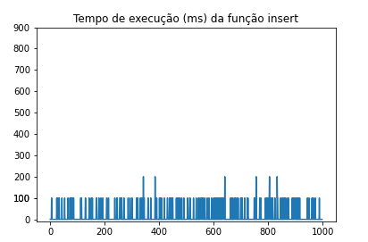
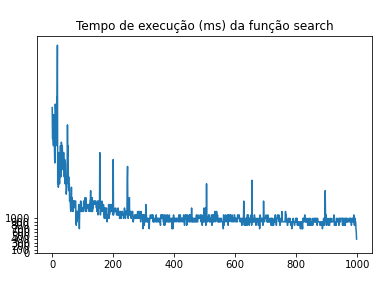
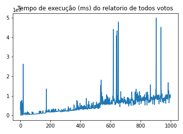
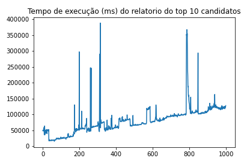

# Sistema de votação

O projeto desenvolvido simula um sistema de votação implementado em C++. 

## Instalação

Para compilar o programa, deve-se navegar até a pasta src e rodar

```
g++ -std=c++11 main.cpp -o main
```

> Atenção: nesse momento, recebe-se alguns warnings referentes a operações e transformações com char[] que seriam corrigidos
> utilizando pacotes de string, como o string.h. Entretanto, o grupo preferiu por não utilizar nenhum pacote de strings nesse 
> trabalho, apenas lidar com char e vetores de char[], como recomendado. Por isso, não foi possível tratar os warnings, que não 
> afetam a execução.

Após isso, para rodar o programa, execute

```
./main
```

## Modelagem Geral

### As estruturas

O sistema foi modelado de forma que:
Os votos são guardados em um array de uma estrutura que denominamos Voto. Essa estrutura contém os seguintes atributos:
- Recibo;
- Id do usuário;
- Id do candidato;
- Região;
- Data do voto;

Os candidatos são guardados em uma Tabela Hash (no programa em C++ modelada como um array com as propriedades de resize, busca por hash e cálculo de hash) onde cada index irá guardar uma estrutura Cand. Essa estrutura contém os seguintes atributos:
- Id do candidato;
- Nome do candidato;
- Quantidade de votos acumulados;

A data é armazenada e repassada através de uma estrutura que denominamos Data. Essa estrutura contém os seguintes atributos:
- Ano;
- Mês;
- Dia;
- Hora;
- Minuto;
- Segundo.

Todas essas estruturas estão envolvidas em uma classe Urna, que contém os seguintes atributos:
- tabela_votos:  array da estrutura Voto;
- tabela_cand: array da estrutura Cand;
- size_v: tamanho disponível no array Votos;
- quant_v: quantidade de votos acumulados no array Votos;
- size_c: tamanho disponível no array Cand;
- quant_c: quantidade de candidatos no array Cand;

O sistema iniciar instanciando uma Urna, que, por sua vez, instancia um vetor de Votos, e o array de Candidatos e seta seus parâmetros referentes à tamanho e quantidade.

### Os algoritmos

Ao iniciar, o sistema inicializa criando o array de Voto com tamanho 100 e o array de Candidatos com tamanho 50. Além disso, seta as variáveis size e quant como 0. Após isso, o sistema carrega o array de Candidatos com 50 candidatos.

#### Inserção de voto - O(1)
O ato de votar é feito através da função insert_voto. Essa função recebe como input
- id do usuário: id incremental gerado pelo sistema.
- id do candidato: números semelhantes a números eleitorais (ex: 55055) fornecido pelo usuário.
- região do usuário: (região calculado pelo sistema - no nosso caso, aleatória).
e devolve como output o recibo do usuário referente àquele voto. A função faz a inserção do voto no index quant_v do array Votos. Além disso, a função também atualiza o atributo quant_v da Urna, incrementando 1. Esse conjunto de operações garante a inserção de votos em O(1). Por fim, essa função, ao salvar o registro do voto, calcula a data e a salva junto.
Em alto nível, o usuário votaria apenas informando o id do candidato. O id do usuário seria um id incremental gerado pelo sistema e a região do usuário também seria calculada pelo sistema.

#### Busca de voto - O(1)
A busca é feita através da função search, que recebe como parâmetro o recibo do voto.
O recibo que o usuário recebe quando insere o voto refere-se ao index de onde o voto foi alocado no array denominado Urna. Dessa forma, garantimos a busca em O(1), pois realizamos a busca acessando o array de votos diretamente em recibo.

#### Relatório com todos votos computados - O(n)
Para retornar todos os votos computados até o momento, a nossa função relatorio_votos() segue a seguinte estrutura:
- Percorrer pelo array de Votos, a fim de recuperar as informações referentes à ele; Caso seja passado uma região para ser filtrada, nesse momento verifica-se se o voto pertence àquele região. Essa operação ocorre em O(n)
- Para cada voto, faz a busca na tabela hash pelo id do candidato, a fim de retornar o nome dele; essa operação ocorre em O(1).
Com esses passos, garantimos que essa operação ocorre em O(n). A ordem dos votos é garantida através da operação de inserção, pois os votos são sempre inseridos ao final do array.

#### Relatório dos dez candidatos com mais votos - O(n)
Para retornar os 10 candidatos que receberam mais votos, computados até o momento, a nossa função relatorio_candidatos() segue a seguinte estrutura:
- Percorrer pelo array de Votos; O(n)
    - Caso o Voto esteja numa data fora da especificada (compara pela função de comparação implementada), então continuamos a percorrer. Caso contrário, seguimos aos próximos passos.
    - Para cada voto, faz a busca na tabela hash pelo id do candidato, e incrementa em 1 o atributo quantidade_votos da estrutura Cand; O(1)
- Percorrer 10x pelo array/hash_table de Cand, buscando quem tem o maior número de votos. Guarda-se o índice de quem teve o maior número de votos; O candidato retornado é adicionado ao relatório e zera-se a quantidade de votos desse candidato. O(10*m).
Com esses passos, garantimos que essa operação ocorre em O(n).

## Resultados

### Inserção
Como podemos ver, a inserção se mostrou em tempo constante O(1), conforme discutido acima. Pelo gráfico, observa-se que, em geral, o tempo variou entre 0 e 100ms.


### Busca de votos
Como previsto, a busca de votos também se comporta em tempo constante O(1).


### Relatório de todos votos computados
Neste gráfico, podemos observar um comportamento de O(n), de forma que, em geral, o tempo foi aumentando linearmente conforme o número de dados foi crescendo.




### Relatório dos 10 candidatos mais votados
Da mesma maneira que o de cima, o gráfico abaixo apresenta um comportamento linear O(n), em geral.


Por fim, acredita-se que os gráficos mostram que os algoritmos cumpriram com a complexidade esperada. Além disso, acredita-se que os outliers encontrados no gráfico se referem ao momento em que acontecem os resizes.

*[Esse projeto foi desenvolvido como atividade da disciplina de Análise de Algoritmos da FGV-EMAp]*
